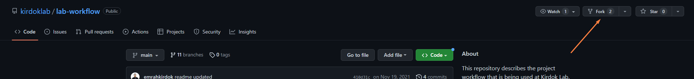
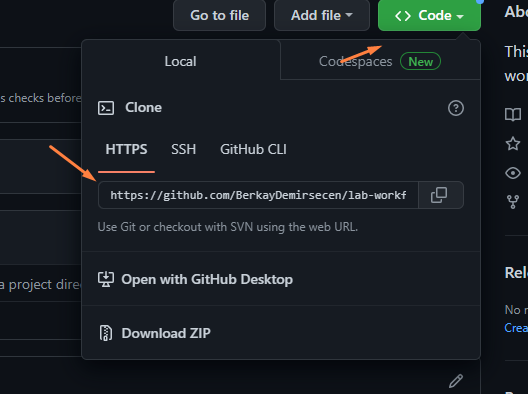
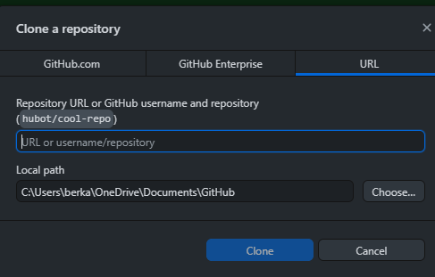
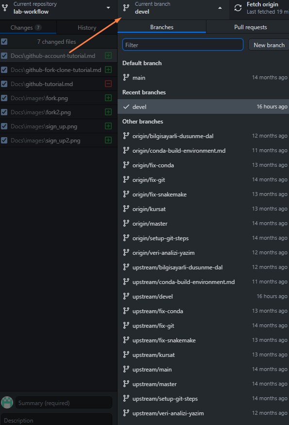
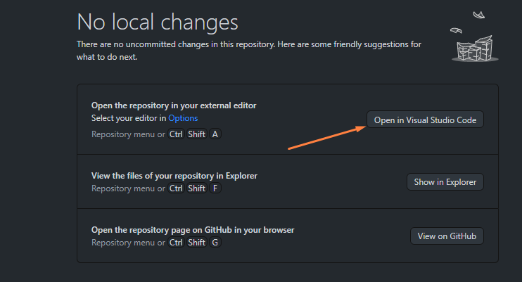
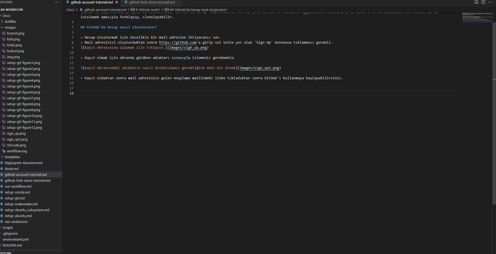

# GitHub'daki projeleri nasıl kullanabilirsiniz?

+ GitHub'daki projeleri öncelikle forklamak sonrasında da kendi çalışma alanına clonelamak gerekir.
+ Fork işlemi, basit olarak, projenin en son hâlini kopyalamak olarak özetlenebilir.
+ Bunun için, belirlediğiniz projenin repository'sine girip aşağıdaki işlemi uygulamanız gerekmekte.

+ Forkladıktan sonra elinizde bir URL olmalı, bu URL'i kopyalayın.

+ Kopyaladığınız URL'yi, aşağıdaki adımları uygulayarak GitHub'ın masaüstü uygulamasına clonelayın.

+ Bu işlemleri yaparken, çalışma yapacağınız branch'i aşağıda gördüğünüz kısımdan değiştirebilirsiniz.

+ Çalışacağınız branch'i seçtikten sonra, tercihen Visual Studio Code'da, düzenlemeye başlayabilirsiniz.

+ Karşınıza çıkan ekranda dosyalar oluşturabilir, dosyaların içeriğini okuyabilir ve ekleme-çıkartmalar yapabilirsiniz.

