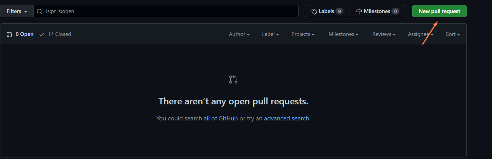
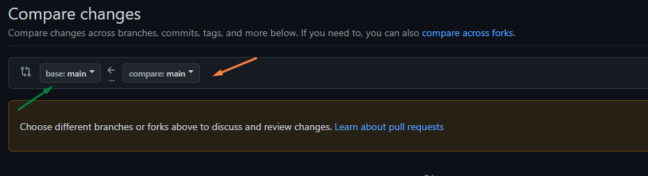

# Pull Request Nedir?

+ Pull Request kısaca yaptığınız değişiklikleri, github'daki orijinal repository'ye mergelemeye başlamaya hazır olduğunu bildirme işlemine denir.

## Pull Request Nasıl Gönderilir?

+ Bunun için yapmış olduğunuz değişiklikleri local repository'ye github desktop üzerinden commitleyin.
+ Commit işlemi bittikten sonra forkladığınız (orijinal) repository'ye girin ve pull request sekmesine tıklayın.

+ Açılan ekranda, 'New Pull Request'e tıklayın.

+ Yeni açılan sekmede, üst tarafta bulunan branchleri seçerken sağ taraftakini değişiklik yapmış olduğunuz **kendi** branchiniz olarak, sol taraftakini ise **değişiklik yapılacak** orijinal branch olarak seçin.

+ Bu işlemler sonrasında tek yapmanız gereken, repository sahibinin pull requestinizi onaylamasını beklemek. 