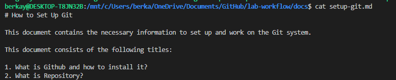
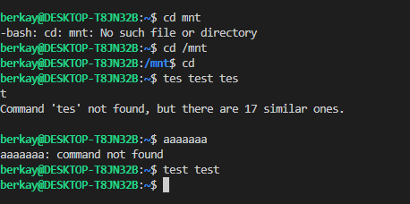
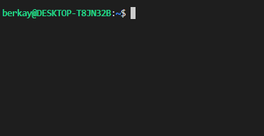

# Linux Komutları nelerdir ve nasıl kullanılır?

+ Öncelikle, linux komut satırına nasıl ulacağınızı öğrenmek ve Ubuntu Subsytsem kurmak için Setup-ubuntu_subsystem.md dosyasını takip edin.
+ Gerekli adımları uyguladıktan sonra, windows arama çubuğunda 'Ubuntu on Windows' yazdıktan sonra ya da VS Code terminali üzerinden Linux seçtikten sonra işlemlerinizi yapabilirsiniz. 

## pwd Komutu 

+ pwd komutunu kullanıdığınızda, çalışmakta olduğunuz dosya konumunu gösterecektir.

## ls Komutu

+ ls komutunu kullandığınızda, içerisinde bulduğunuz dosya konumunda bulunan dosyaları gösterecektir.

## cat Komutu

+ cat komutu, bir argümanla beraber kullanıldığında, dosyanın içeriğini gösterecektir.

## cd Komutu

+ cd komutu, buldunduğunuz dosya konumunu değiştirmeye yarar.

## clear Komutu

+ clear komutu, adından da anlaşılabileceği gibi, konsolun tamamını silecektir.

## cp Komutu

+ cp komutu, bir dosyayı ya da dosya konumunun tamamını kopyalamaya yarar.

## mv Komutu

+ mv komutu, bir dosyayı başka bir konuma taşımaya yarar. Aynı zamanda, bir dosyanın ismini değiştirmek için de kullanılabilir.

## rm Komutu

+ rm komutu, verilen argümanı silmeye yarar ve **dikkatli kullanılması** gerekmektedir.

