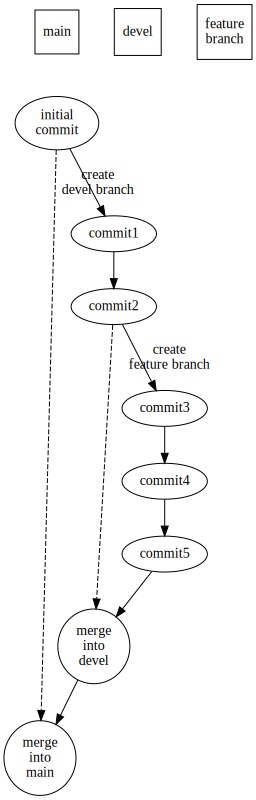

# Our workflow

Our workflow starts with creating a repository. Generally, a user creates a repository on GitHub system. Then clones this repo to the local computer.

THe member then should create a `README.md` file in the `main` branch. This file should explain two things:

1. The overall aim of the project
2. Following steps
3. What will be the first version?

We keep the working version of our project in the `main` branch. So, we merge other branches into the main branch if we have a working version.

Member should commit this file and pushes to the GitHub.

## Creating the `devel` branch

We aim to develop our project in the `devel` branch. But members should not commit in this branch. In our weekly meetings, we decide on the ideas that will be added in the project. So, each member will create a branch that will seperate these ideas in several branches. With this way, we aim to minimise merge conflicts.

> If our project is a book, then branches are the ideas. And commits are the paragraphs.

## Developing ideas in a branch

After our meeting, we seperate the work packages. Members then start from this point. To create a new branch, members can follow this bullet points:

+ Pulling the latest state of the `devel` branch
+ Creating a new branch based on this point
+ Developing the ideas as commits
+ Sending a pull request to merge the idea into the `devel` branch

The person who is responsible on the pull request will review the changes and confirm the merge process.

## The flowchart of the process

The following flowchart can summarise this workflow:

