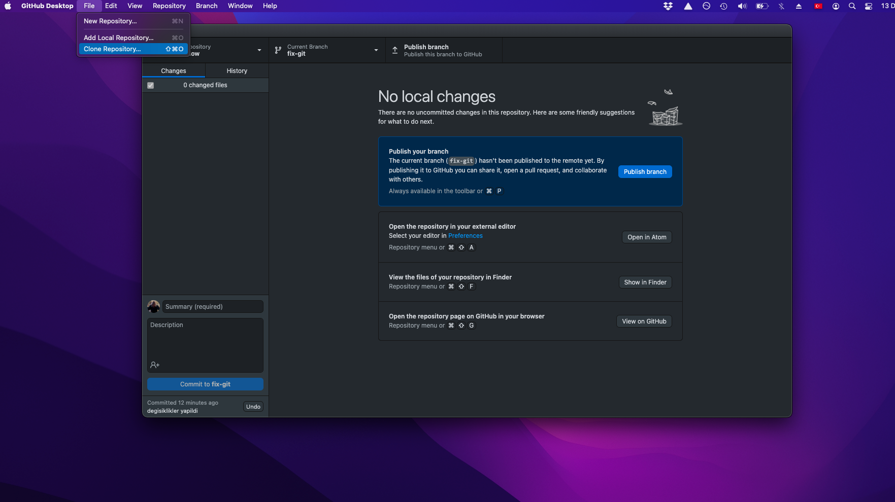

# Git sistemini kurmak

Bu dökümanda, git sistemini hazırlamak ve git sistmi üzerinde çalışmak için gerekli bilgiler sunulmuştur. Bu döküman aşağıdaki başlıklardan oluştmaktadır:

+ Github programını yüklemek
+ Proje olıuşturmak
+ Git repo'su klonlamak
+ Değişikiklikleri commit etmek
+ değişiliklieri sunucuya yüklemek
+ sunucundan değişikiklierleri çekmek (pull)
+ dal oluşturmak

## Git hub programını yüklemek

[Github internet sitesine](https://desktop.github.com) giderek program indirilir.

Adımlar takip edileirek program yüklenir.

## Proje klonlamak

Github progrmaı açılır, vve Fİle sekmesi üstünden clone repositiry tıklanır:

Git ve Github birbirinden farklı uygulamalardır. Git'in görevi metin dosyalarındaki yapılan değişiklikleri takip etmek ve yapılan bu değişiklikleri bir veri içerisinde saklamaktır.

Github ise, bu değişikliklerin internet üzerinden saklandığı platformdur. Bu platform içerisinde main ve devel gibi farklı brunchlar bulunmaktadır. Main dalı, her zaman projenin son kullanılabilir halidir.

Yapılan değişiklikler ise devel üzerinden takip edilir.

Proje üzerinde çalışılırken devel dalına, herkes kendine ait brunchlar oluşturur ve değişikliklerini bu brunchlar içerisinde yapar. 
